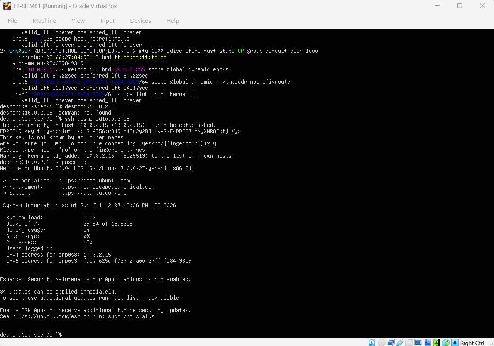

# 🛡️ Enterprise SIEM Deployment (Splunk)

## 📌 Project Overview
Deployed and configured a Splunk Enterprise Security Information and Event Management (SIEM) environment to monitor, ingest, and analyze security telemetry from a vulnerable Active Directory domain. This project demonstrates proficiency in enterprise log management, custom SPL (Splunk Processing Language) querying, and active threat hunting.

## 🏗️ Architecture & Naming Convention
To mirror an enterprise environment, strict naming conventions and isolated virtual networking were enforced:
* **`ET-DC01`:** Windows Server Domain Controller (Log Source / Victim Machine)
* **`ET-SIEM01`:** Ubuntu Server 24.04 LTS (Headless Splunk Enterprise Engine)
* **Network:** Both machines share an isolated, host-only NAT network to ensure secure telemetry delivery.

---

## 🛠️ Phase 1: SIEM Provisioning & Installation
Provisioned a dedicated, headless Linux server (`ET-SIEM01`) to host the Splunk Enterprise engine, prioritizing resource allocation for high-speed log parsing. Remote administration was established via SSH to execute the deployment.

*(Screenshot 1: SSH Connection to ET-SIEM01)*

*(Screenshot 2: Splunk Installation Success)*
---

## 📡 Phase 2: Telemetry & Log Ingestion
*(We will fill this section out when we install the Universal Forwarder on the Windows Server!)*

---

## ⚔️ Phase 3: Attack Simulation & Threat Hunting
*(We will fill this section out when we brute-force the server and track Event ID 4625!)*
