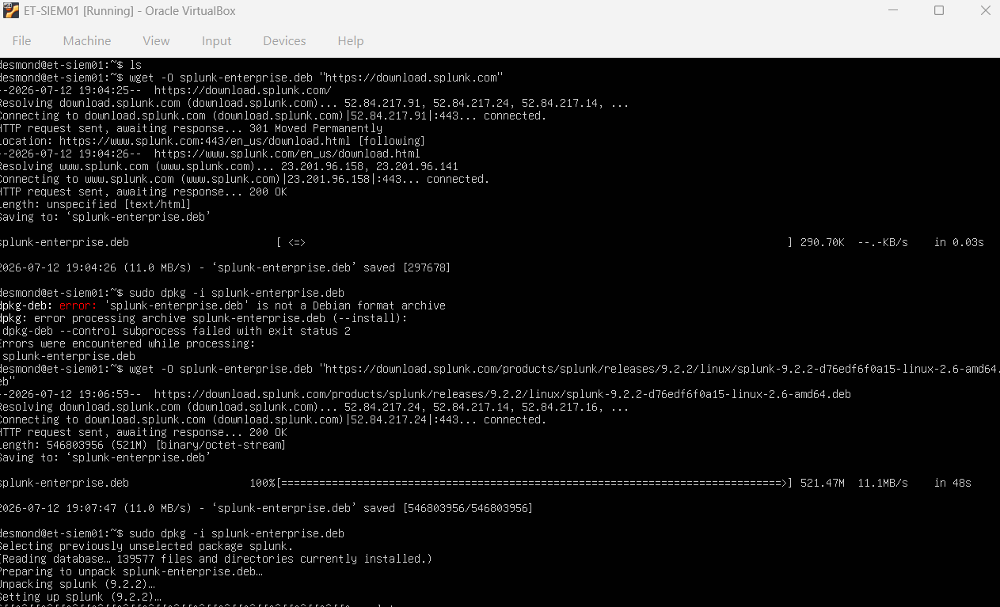
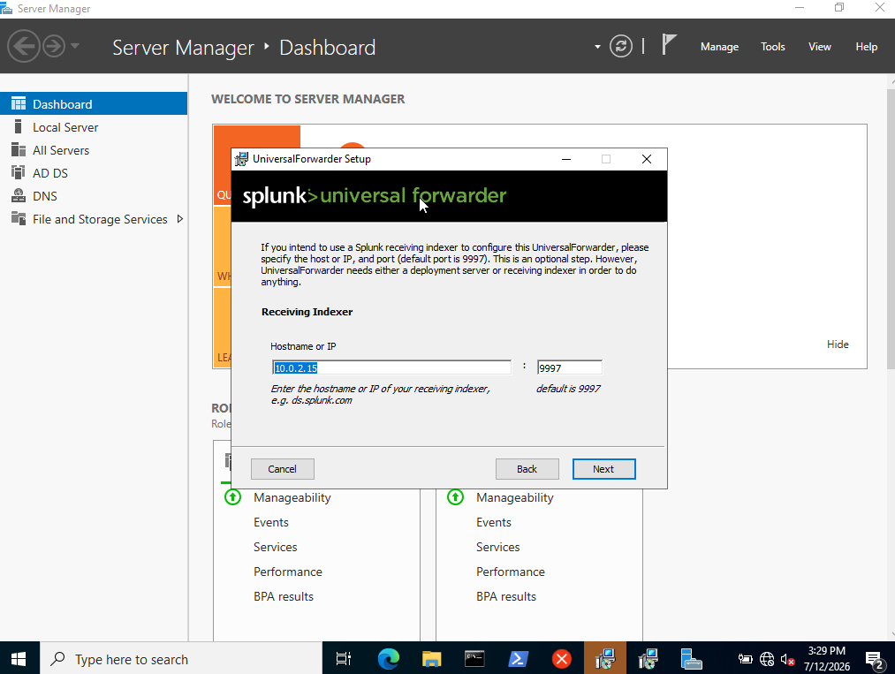
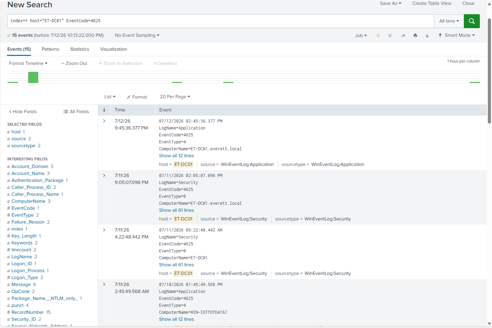

# 🛡️ Enterprise SIEM Deployment (Splunk)

## 📌 Project Overview
Deployed and configured a Splunk Enterprise Security Information and Event Management (SIEM) environment to monitor, ingest, and analyze security telemetry from a vulnerable Active Directory domain. This project demonstrates proficiency in enterprise log management, custom SPL (Splunk Processing Language) querying, and active threat hunting.

## 🏗️ Architecture & Naming Convention
To mirror an enterprise environment, strict naming conventions and isolated virtual networking were enforced:
- **ET-DC01**: Windows Server Domain Controller (Log Source / Victim Machine)
- **ET-SIEM01**: Ubuntu Server 24.04 LTS (Headless Splunk Enterprise Engine)
- **Network**: Both machines share an isolated, host-only NAT network to ensure secure telemetry delivery.

---

## 🛠️ Phase 1: SIEM Provisioning & Installation
Provisioned a dedicated, headless Linux server (`ET-SIEM01`) to host the Splunk Enterprise engine, prioritizing resource allocation for high-speed log parsing. Remote administration was established via SSH to execute the deployment.

*(Screenshot 1: SSH Connection to ET-SIEM01)*

*(Screenshot 2: Splunk Service Running)*

---

## 📡 Phase 2: Telemetry & Log Ingestion
Configured `ET-DC01` (Windows Server) to act as the primary log source. Installed and configured the Splunk Universal Forwarder to continuously ship Windows Event Logs (Security, System, Application) over the internal NAT network to the `ET-SIEM01` indexer.

*(Screenshot 3: Windows Server Universal Forwarder Configuration)*

*(Screenshot 4: Splunk Receiving Logs)*

---

## ⚔️ Phase 3: Attack Simulation & Threat Hunting
Simulated an adversary attempting to compromise the Active Directory Domain Controller via a brute-force credential attack. Leveraged custom SPL (Splunk Processing Language) queries to filter out normal background noise and isolate the anomalous authentication behavior, specifically tracking Event ID 4625 (Failed Logon).

*(Screenshot 5: Brute Force Attack Execution)*

*(Screenshot 6: Splunk Dashboard Querying Event ID 4625)*

---

## 🔧 Troubleshooting & Lessons Learned
Building an enterprise network inside an isolated virtual environment presented several real-world IT challenges that required dynamic troubleshooting:

* **Command Line vs. GUI Service Restarts:** Encountered "invalid service name" errors when attempting to restart the Splunk Universal Forwarder using PowerShell and classic `net start/stop` commands. 
    * *Workaround:* Pivoted away from the terminal and utilized the Windows `services.msc` Graphical User Interface (GUI) to manually force the service reboots, completely bypassing the localized CLI syntax blockers.
* **The Hidden `.txt` Extension Trap:** The log pipeline initially failed because Windows Notepad silently appended a `.txt` extension to the custom configuration files (e.g., `inputs.conf.txt`). 
    * *Lesson:* Splunk strictly requires exact `.conf` formatting and will silently ignore misnamed files. Enabled "File name extensions" in the Windows View ribbon to expose and correct the hidden extensions and minor typos (like `inputs.conif`).
* **VirtualBox Limitations & Manual Configuration:** Due to the lack of host-to-guest copy-paste functionality in the isolated VM, configuration scripts had to be typed manually.
    * *Lesson:* Condensed standard spaced-out configuration formats into bare-minimum, tightly packed syntax to reduce the margin of manual typing errors.
* **VM Clock Drift (The Time Travel Bug):** Successfully executed the brute-force attack, but the telemetry was initially invisible in the Splunk dashboard. Discovered the VirtualBox VM's internal clock had drifted hours into the future, stamping the logs with times outside the dashboard's scope. 
    * *Workaround:* Shifted the Splunk search parameters from "Last 24 Hours" to a historical "All Time" search, which successfully bypassed the clock drift and uncovered the future-stamped attack logs.

---

## 🎯 Project Outcomes
- Successfully built an enterprise-grade SIEM environment from the ground up, linking Windows and Linux architectures over an isolated virtual network.
- Achieved full visibility into endpoint telemetry, automatically processing thousands of Windows Event Logs in real time.
- Demonstrated the capability to actively monitor, hunt, and detect specific adversarial behaviors (credential brute-force) using targeted SPL queries.

---

## 📂 Related Files
- **`inputs.conf`** - Configured on the Universal Forwarder to explicitly define which Windows event channels (Application, Security, System) to monitor and collect.
- **`outputs.conf`** - Configured on the Universal Forwarder to dictate the target IP address and receiving port of the central Splunk Indexer.
